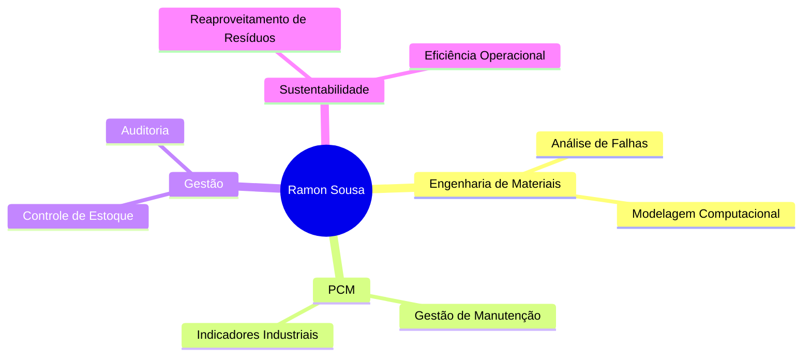

  
# 👨‍💼 Ramon Sousa dos Santos

  

 

  <table>
    <tr>
      <td align="center">
        
      </td>
      <td align="center">
        
      </td>
      <td align="center">
        
      </td>
    </tr>
  </table>

 

  

---

## 🎓 Formação Acadêmica

  <table>
    <tr>
      <td>
        
      </td>
    </tr>
    <tr>
      <td align="center">
        <strong>Instituto Federal do Pará (IFPA)</strong> 
        <em>Agosto 2021 – Agosto 2026</em>
      </td>
    </tr>
  </table>

---

## 💼 Experiência Profissional

### 🏭 Estagiário em PCM – Nacional Gás
*06/2025 – Atual*

- ⚙️ Gestão de ordens de serviço e planos preventivos
- 📊 Indicadores: MTTR, MTBF, backlog e confiabilidade
- 🛠️ Ferramentas: SAP-PM e Oracle EDS

### 📋 Auxiliar de Auditoria – RGIS
*08/2024 – 02/2025*

- 🔍 Contagem e conferência de inventários
- ✅ Validação de dados e suporte à auditoria

### 📦 Auxiliar Administrativo – CBMPA
*03/2021 – 03/2023*

- 📊 Controle de estoque e rotinas administrativas
- 🚚 Distribuição logística e gestão de contratos

---

## 🛠️ Stack Tecnológica

  
### 📊 Análise de Dados & Business Intelligence

  
  

### 🏭 Sistemas Industriais & ERP

  
  

### 📈 Metodologias & Certificações

  <table>
    <tr>
      <td align="center">
        
      </td>
    </tr>
    <tr>
      <td align="center">
        
      </td>
    </tr>
  </table>

---

## 🎯 Áreas de Atuação

### 🔬 **Engenharia de Materiais**
- Análise de falhas e propriedades de materiais
- Modelagem computacional
- Desenvolvimento de novos materiais

### ⚙️ **PCM (Planejamento e Controle de Manutenção)**
- Gestão de ordens de serviço
- Análise de indicadores (MTTR, MTBF)
- Otimização de processos de manutenção

### 📊 **Controle de Estoque**
- Gestão de inventários
- Otimização de processos logísticos
- Auditoria e validação de dados

### 🌱 **Sustentabilidade Industrial**
- Reaproveitamento de resíduos
- Implementação de práticas sustentáveis
- Melhoria contínua de processos

---

## 📈 Competências Técnicas

| Área | Nível | Experiência |
|------|-------|-------------|
| **SAP-PM** | ⭐⭐⭐⭐⭐ | Gestão de manutenção |
| **Oracle EDS** | ⭐⭐⭐⭐⭐ | Análise de dados |
| **Excel Avançado** | ⭐⭐⭐⭐⭐ | VBA, Dashboards |
| **Power BI** | ⭐⭐⭐⭐⭐ | Business Intelligence |
| **Lean Six Sigma** | ⭐⭐⭐⭐ | Melhoria de processos |
| **PCM** | ⭐⭐⭐⭐⭐ | Planejamento e controle |

---

## 🎯 Perfil Profissional

> **Graduando em Engenharia de Materiais** com sólida experiência em **PCM**, **gestão de estoque** e **projetos de sustentabilidade**. Atuação comprovada em empresas públicas e privadas, com domínio de ferramentas como **SAP-PM**, **Oracle EDS**, **Excel Avançado** e **Power BI**.

### 🚀 Características
- 📊 **Analítico**: Forte capacidade de análise de dados e indicadores
- ⚡ **Proativo**: Iniciativa para identificar e resolver problemas
- 🎯 **Orientado a Resultados**: Foco em eficiência e otimização
- 🌱 **Sustentabilidade**: Paixão por soluções ambientalmente responsáveis
- 📈 **Melhoria Contínua**: Certificação Lean Six Sigma White Belt

---

## 📫 Como me encontrar

---

  <h3>💡 "A inovação na engenharia começa com a sustentabilidade e eficiência"</h3>
  
Sempre em busca de soluções que unam tecnologia, eficiência e responsabilidade ambiental! 🌱⚙️

---

  

